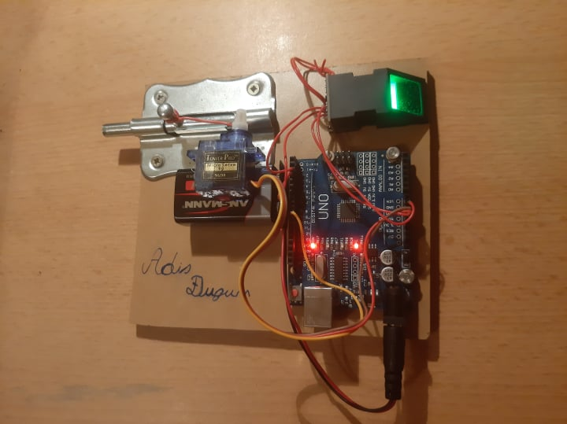

# arduino-fingerprint-door-lock
My 2021 high school graduation project – a fingerprint-controlled electronic door lock built with Arduino UNO.

# Arduino Fingerprint Door Lock 🔐

A fingerprint-controlled electronic door lock built with an Arduino UNO.

This project was originally developed in **2021 as my high school graduation project (maturski rad)** at the Technical High School in Bugojno, Bosnia and Herzegovina.

The goal of the project was to build a physical prototype of an electronic lock that authenticates a user using a fingerprint sensor and controls a mechanical locking mechanism with a servo motor.

## How It Works

The fingerprint sensor scans the user's fingerprint and sends the data to the Arduino UNO.

If the fingerprint matches one of the stored fingerprints, the Arduino activates the SG90 servo motor. The servo moves the mechanical locking mechanism between the locked and unlocked positions.

## Hardware

- Arduino UNO
- Optical fingerprint sensor
- SG90 servo motor
- 9V battery
- Custom wooden prototype
- Mechanical locking mechanism

## Software

The Arduino sketch uses:

- `Adafruit_Fingerprint`
- `Servo`
- `SoftwareSerial`

The fingerprint sensor communicates with the Arduino through software serial, while the servo motor controls the physical locking mechanism.

## Source Code

The Arduino source code is available in:

`fingerprint_door_lock.ino`

The original project was created in 2021. The original Arduino project file was no longer available when this repository was created, so the `.ino` file in this repository was reconstructed from the source code preserved in the graduation thesis.

The reconstruction preserves the documented behavior and structure of the original project, with formatting and structural issues caused by the PDF representation corrected where necessary.

## Documentation

The original graduation thesis is available in:

`maturski-rad.pdf`

The document contains the project description, hardware overview, fingerprint sensor explanation, circuit/wiring diagram, prototype construction, operating principle, and the Arduino code preserved from the original project.

> The thesis is written in Bosnian.

## Project Background

This was one of my early electronics and programming projects and was completed as part of my high school education in computer engineering and automation.

The project gave me practical experience with:

- Arduino and microcontrollers
- C/C++ programming
- Biometric sensors
- Servo motor control
- Serial communication
- Hardware prototyping
- Combining software and electronics into a working physical system

## Year

**2021**
